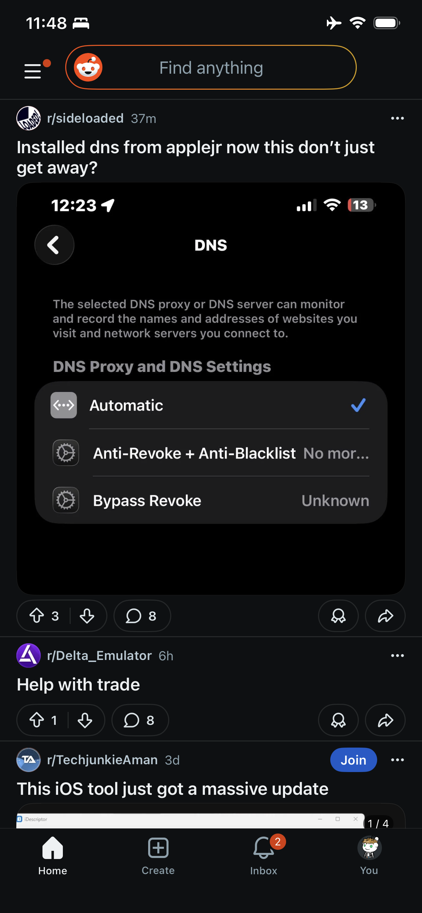
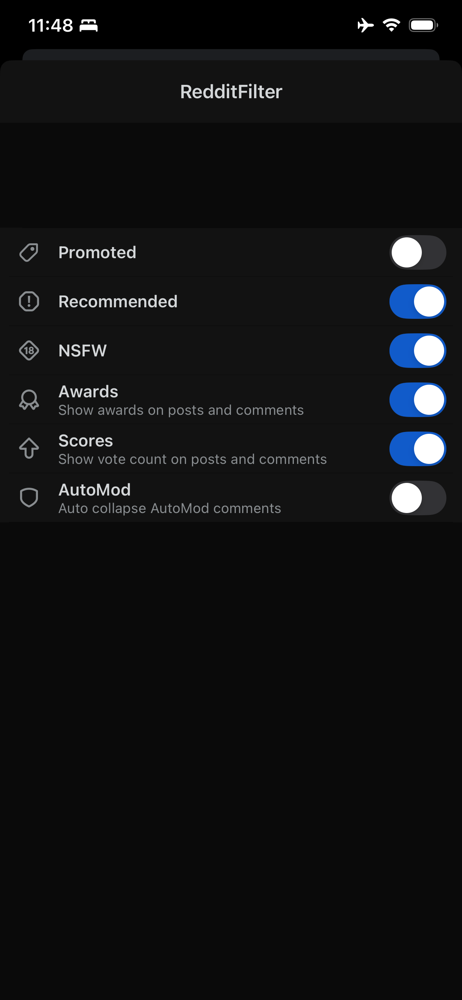

# Reddit Deluxe / Reddit Filter

A reproducible and automated way to build a modified Reddit iOS application with injected tweaks.

---

## Overview

**Reddit Deluxe (Reddit Filter)** is a project that lets you build a customized version of the Reddit iOS app by injecting dynamic libraries (`.dylib`) into a clean Reddit `.ipa`.

This repository includes a GitHub Actions workflow that automates the full process:

- downloading or using a clean/decrypted Reddit `.ipa`
- extracting the app bundle
- copying tweak libraries and required frameworks
- injecting the tweaks into the app executable
- signing all required binaries
- rebuilding a ready-to-install `.ipa`

The goal is to make the process reproducible, easier to maintain, and accessible even for people who do not want to patch everything manually.

---

## Key Features

- Automated `.ipa` patching via GitHub Actions
- Dynamic tweak injection (`.dylib` support)
- Automatic framework handling
- Integrated signing
- Plug-and-play tweak workflow
- Reproducible builds
- Easy customization through the `.dylib` folder

---

## Screenshots

### Main feed

### Comment view

### Tweak settings

---

## How It Works

The workflow performs the following steps:

1. Gets a clean/decrypted Reddit `.ipa`
2. Extracts the application bundle
3. Copies all `.dylib` and `.framework` files from the repository
4. Injects the tweak libraries into the main executable
5. Signs all required binaries
6. Repackages the application into a new `.ipa`

---

## Getting Started

Follow these steps to build your own customized Reddit application.

### 1. Fork the repository

Click the **Fork** button in the top-right corner of this page.

### 2. Open your fork

Navigate to your personal copy of the repository.

### 3. Enable GitHub Actions

- Go to the **Actions** tab
- If prompted, enable workflows

### 4. Run the workflow

- Go to the **Actions** tab
- Select the workflow:
  - **RD** → to build **Reddit Deluxe**
  - **CI** → to build **Reddit Filter (base version)**
- Click **Run workflow**

### 5. Provide a base IPA

You must provide a **direct URL to a clean/decrypted Reddit `.ipa`**.

This file will be used as the base application for patching.

### 6. Build the application

Start the workflow and wait for completion.

During execution, the pipeline will:

- download the base `.ipa`
- inject all tweaks
- sign the application
- generate the final build

### 7. Download the output

Once the workflow finishes:

- scroll to the **Artifacts** section
- download the generated `.ipa`

---

## Custom Tweaks

All tweak files are stored in the `.dylib` directory.

To add your own tweaks:

1. Place your `.dylib` file inside the `.dylib` folder
2. Include any required `.framework` dependencies if needed
3. Commit and push your changes
4. Re-run the workflow

The system will automatically detect and inject compatible libraries.

---

## Notes

- A **decrypted Reddit `.ipa` is required**
- Not all tweaks are compatible with each other
- If the app crashes, remove recently added `.dylib` files
- Injection order and signing are handled automatically
- `libsubstrate.dylib` dependencies are handled by the workflow

---

## Disclaimer

This project is provided for educational and research purposes only.

You are solely responsible for how you use this repository and any generated application builds.

---

## Acknowledgements

This project builds upon and was inspired by the work of:

[level3tjg](https://github.com/level3tjg)

---

## Contributing

Contributions, improvements, and suggestions are welcome.

Feel free to open an issue or submit a pull request.

---

## Repository

https://github.com/surrel14/RedditFilter
